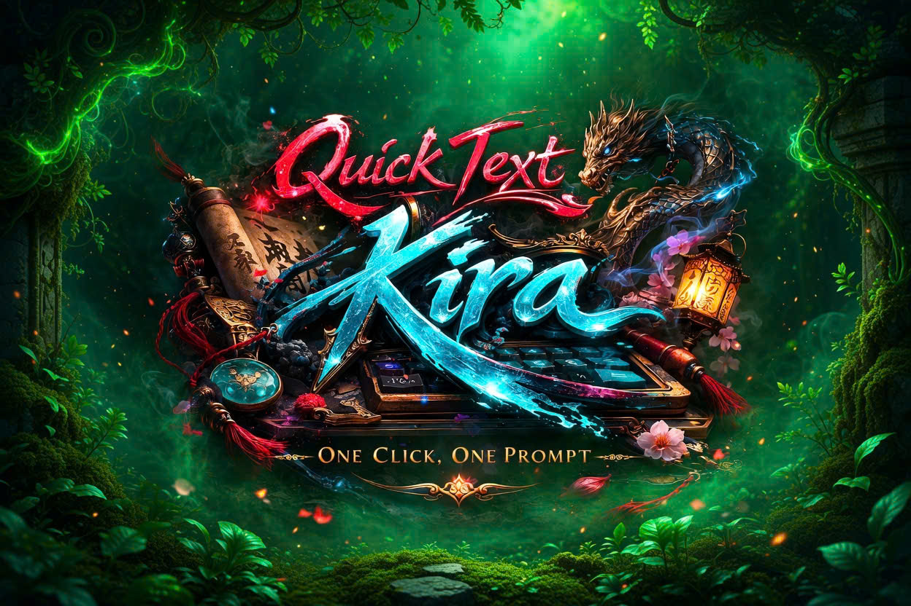

  

  

<h1 align="center">QuickText</h1>

  Desktop overlay cho game/chat với mục tiêu: <strong>gửi nhanh - quản lý gọn - thao tác 1 chạm</strong>.

  <a href="https://github.com/AkiyamaKira2003/Quick-text-manager/releases/latest">Download Latest Release</a>

## QuickText Là Gì?

QuickText là ứng dụng desktop giúp bạn quản lý câu chat mẫu và hiển thị overlay nổi trên màn hình, để chuyển câu và gửi câu cực nhanh trong lúc đang chơi game hoặc thao tác toàn màn hình.

Mục tiêu của dự án không chỉ là gửi text nhanh, mà còn là giữ trải nghiệm mượt, ít gián đoạn và dễ làm chủ bằng hotkey.

## Chức Năng Nổi Bật

- Text Manager tập trung:
  Lưu danh sách câu chat, ghi chú từng câu, chọn nhanh câu đang dùng.
- Overlay nổi trong game:
  Hiển thị text hiện tại trực tiếp trên màn hình, có thể bật/tắt tức thời.
- Chỉnh overlay trực tiếp:
  Kéo vị trí, chỉnh opacity, cỡ chữ, màu chữ, canh lề, bật/tắt từng thành phần.
- Bộ hotkey đầy đủ:
  Bật/tắt overlay, bật/tắt toàn app, bật chế độ chỉnh overlay, gửi câu hiện tại, hiện/ẩn manager.
- Chuyển câu bằng thao tác nhanh:
  `Shift + Wheel` để đổi câu trước/sau mượt trong ngữ cảnh game.
- Cấu hình đồng bộ:
  Cài đặt UI, overlay, hotkey và hành vi gửi được lưu lại xuyên suốt các phiên.
- Telemetry cơ bản:
  Theo dõi số lần gửi thành công/thất bại, độ trễ và lỗi hotkey để debug nhanh.
- 1-click launcher update:
  Launcher tự check phiên bản mới, tải bản mới, verify checksum, giải nén và chạy app.

## Trải Nghiệm Người Dùng

- 1 click mở app.
- 1 click tự cập nhật khi có bản mới.
- 1 click quay lại thao tác chính mà không cần xử lý cài đặt phức tạp.

## Công Nghệ

- Electron
- Next.js + React + TypeScript
- Python bridge (Flask + input hooks)

## Người Tạo Dự Án

**Kira**  
GitHub: [@AkiyamaKira2003](https://github.com/AkiyamaKira2003)

QuickText được xây để giải quyết bài toán thực tế: cần phản hồi nhanh trong game nhưng vẫn giữ được tính tự nhiên, dễ kiểm soát và dễ tùy biến.

## Giấy Phép

Dự án phát hành theo giấy phép MIT.  
Xem [LICENSE](LICENSE) và [COPYRIGHT.md](COPYRIGHT.md).
